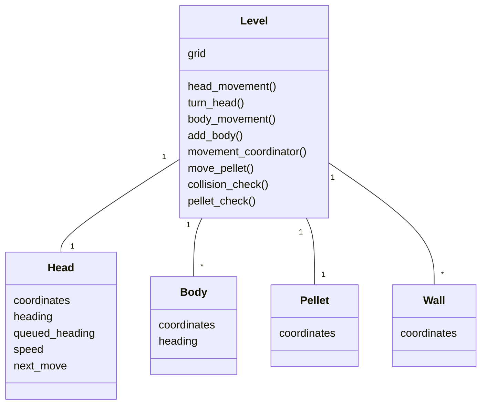
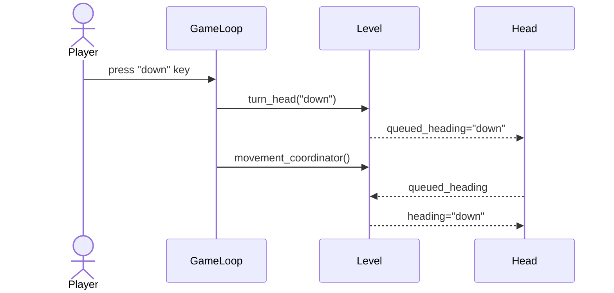

# Arkkitehtuurikuvaus

## Käyttöliittymä
Käyttöliittymässä on varsinaisen pelin lisäksi kaksi näkymää: päävalikko ja "game over" ruutu, johon kirjoitetaan pelaajan nimi.

Nimen kirjoittamista varten on kokonaan oma TextHandler-luokka, ja päävalikon toiminnasta vastaa MainMenu- ja MenuLoop luokat.

## Sovellusslogiikka

## Tietojen pysyväistallennus
ScoreRepository-luokka vastaa ennätysten tallentamisesta SQLite-tietokantaan. 

### Tiedostot

Ennätykset tallennetaan SQLite-tiedostoon, jonka nimi voidaan määritellä .env konfiguraatiotiedostossa.

## Päätoiminnallisuudet
Kuvataan päätoiminnallisuuksia sekvenssi kaavioilla.

### Kääntyminen

Kun pelin kulkiessa painetaan jotakin nuolinäppäintä, esimerkikisi alasnuolta, niin peli toimii seuraavasti:

GameLoop tunnistaa nuolinäppäimen painalluksen ja kutsuu Level-luokan metodia, joka kääntää madon päätä. Metodi tarkistaa onko kääntyminen sallittu ja muuttaa Head-luokan suunnaksi "down". Seuraavaksi GameLoop kutsuu toista Level metodia, joka lopullisesti toteuttaa madon kääntymisen.
