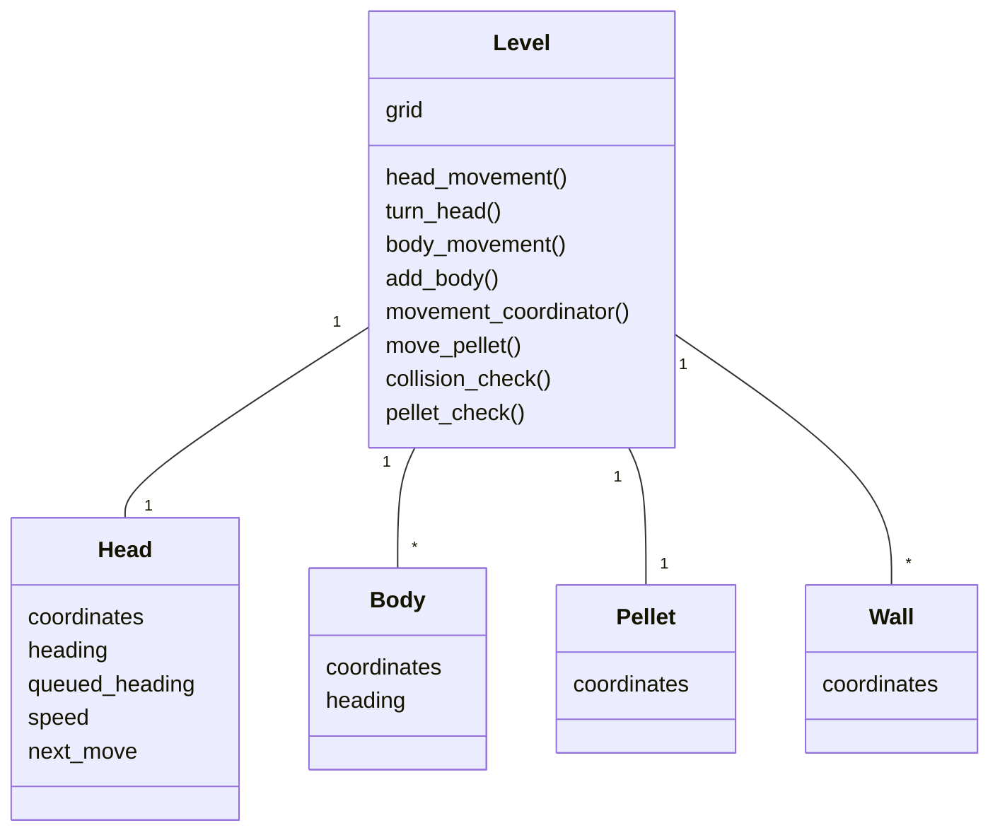
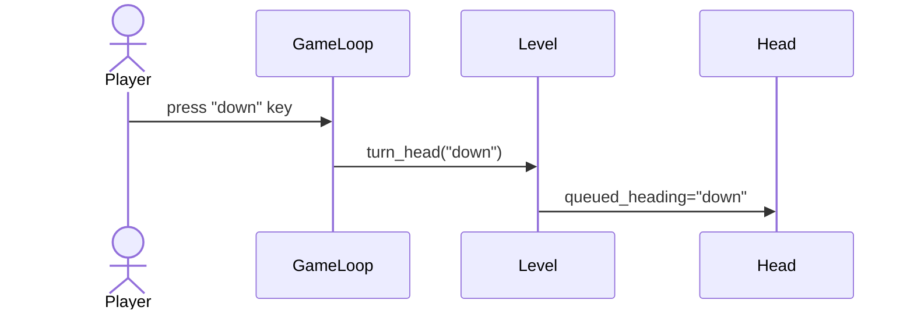

```mermaid
classDiagram
    class Head
    Head : coordinates
    Head : heading
    Head : queued_heading
    Head : speed
    Head : next_move
    class Body
    Body : coordinates
    Body : heading 
    class Pellet
    Pellet : coordinates
    class Wall
    Wall : coordinates
    class Level
    Level : grid
    Level : head_movement()
    Level : turn_head()
    Level : body_movement()
    Level : add_body()
    Level : movement_coordinator()
    Level : move_pellet()
    Level : collision_check()
    Level : pellet_check()
    Level "1" -- "1" Head
    Level "1" -- "*" Body
    Level "1" -- "1" Pellet
    Level "1" -- "*" Wall
```

```mermaid
sequenceDiagram
    actor Player
    participant GameLoop
    participant Level
    participant Head
    Player->>GameLoop: press "down" key
    GameLoop->>Level: turn_head("down")
    Level->>Head: queued_heading="down"
```
